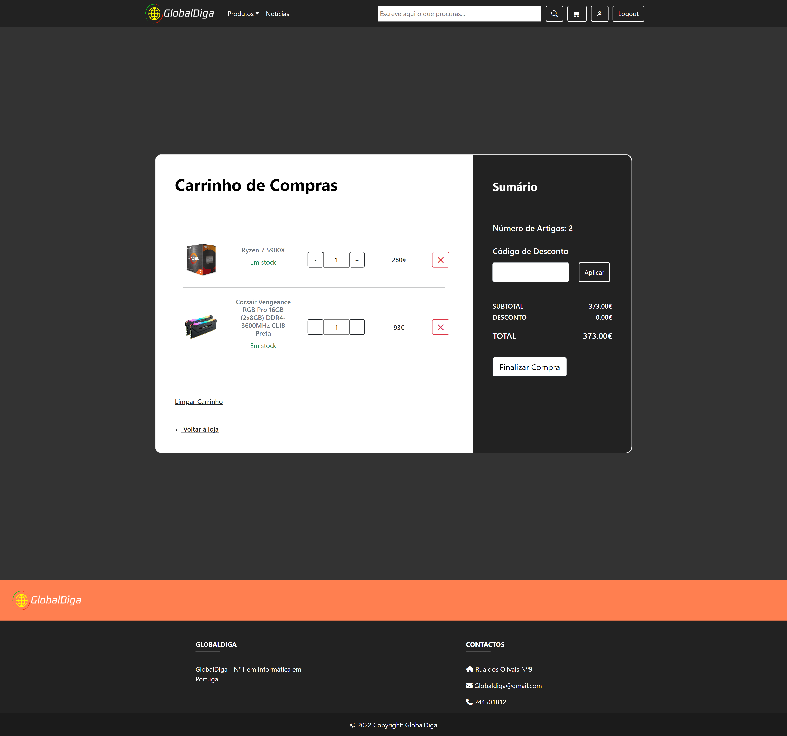
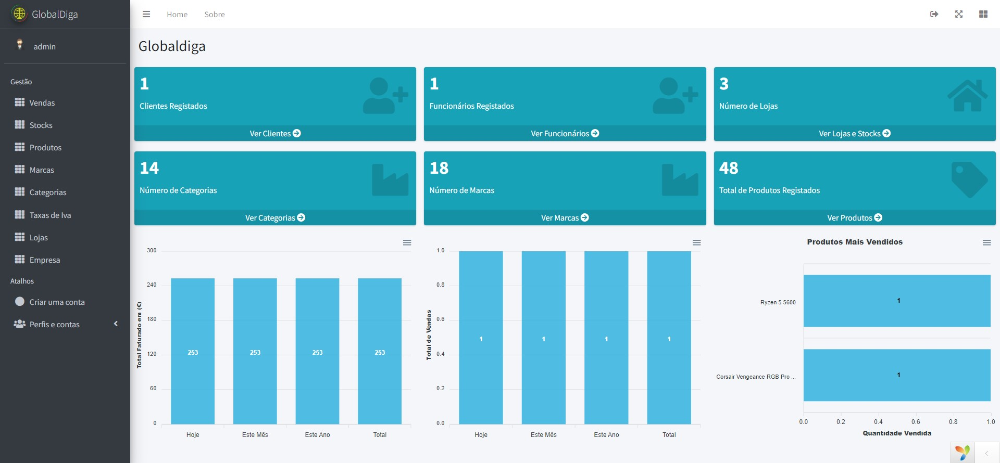
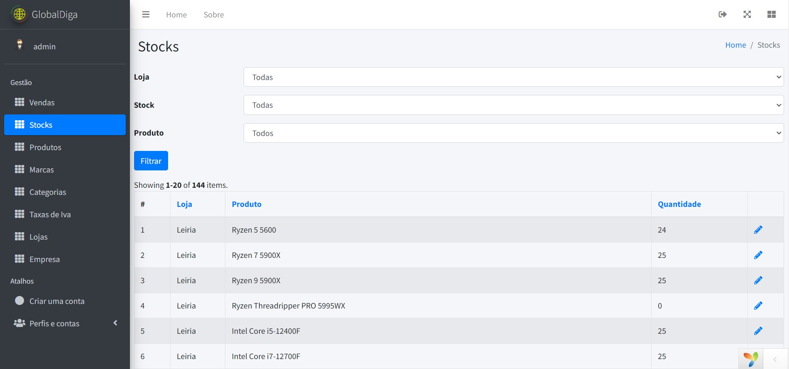
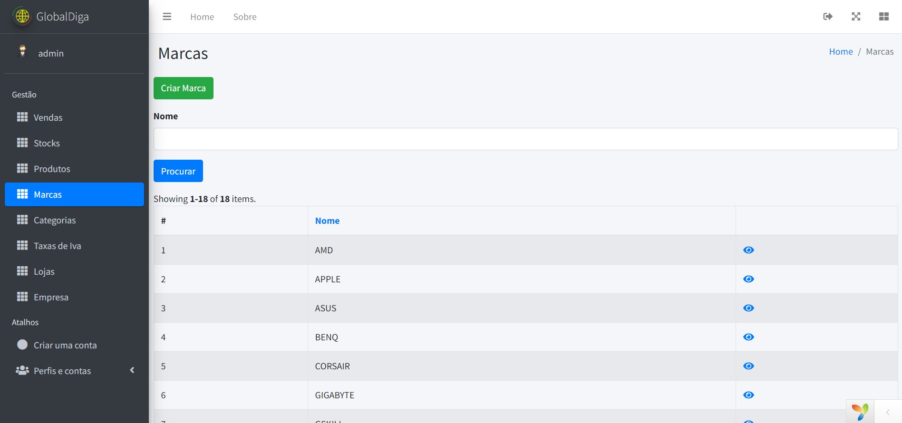
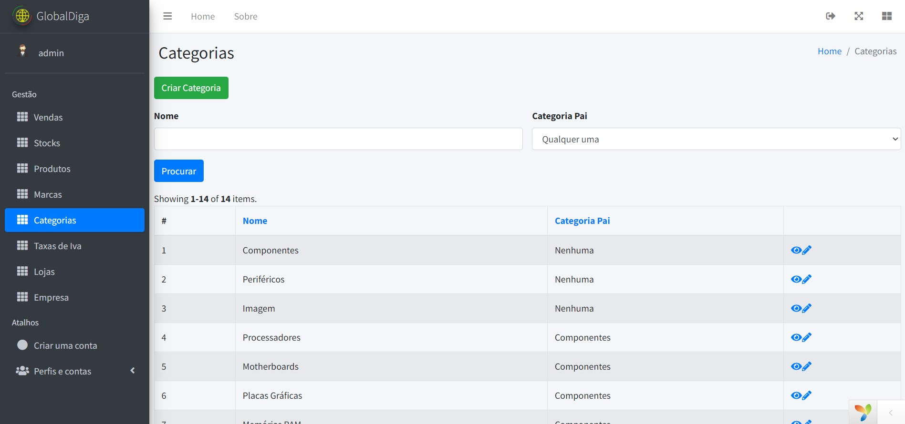
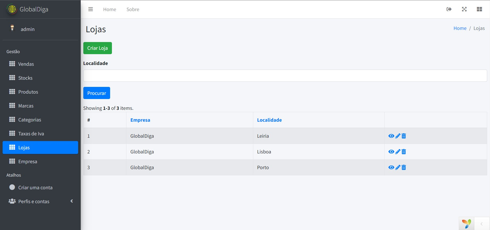

# Project GlobalDiga [Web Application]

 

 

[About](about.md) • [Installation](Install.md) • [Mobile APP](https://github.com/JoaoJesus1337/GlobalDiga_Mobile_App)

 

# FRONTEND

## Main Page

 

 

## Product Details

 

 

## Products Page

 

 

## Login

 

 

## Register

 

 

## Shopping Cart

 

 

## Payment Methods

 

 

## Invoices

 

 

## Invoices Details [PDF]

 

 

## User Profile

 

 

# BACKEND

## Dashboard

 

 

## Sales

 

 

## Stocks

 

 

## Products

 

 

## Brands

 

 

## Category

 

 

## Taxes

 

 

## Stores

 

 

## Company

 

 

 

# CO-Authors

 

[@RodrigoCarreira](https://github.com/RFCarreira33)

[@JoaoFerreira](https://github.com/JPTRON)
